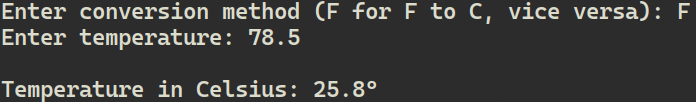
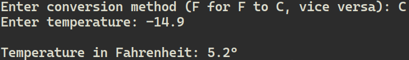

## Description
A learning project for getting comfortable with Rust -- input handling, `Option`, error handling,  and pattern matching. A command-line temperature converter.

## What it does
Converts temperatures from Fahrenheit to Celsius, and vice versa. It validates the conversion method and re-prompts on bad input.

## How to run
1. Make sure Rust is installed.
2. Clone the repo.
3. Run `cargo run`

## Usage example
*Converting Fahrenheit to Celsius*

*Converting Celsius to Fahrenheit*

